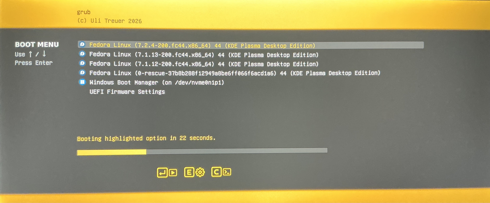

# Uli GRUB Theme

A clean, minimalist GRUB 2 theme designed for modern widescreen displays.



## Features

- Minimalist, modern layout
- DejaVu Sans typography
- Clear highlighting of the selected boot entry
- Boot countdown with progress bar
- Keyboard/action hints
- Designed with widescreen and ultrawide displays in mind
- Percentage-based layout for flexible positioning

## Download

The latest release is available as **v0.1.1**.

You can either clone the repository:

```bash
git clone https://github.com/ulitreuer/uli-grub-theme.git
cd uli-grub-theme
```
or download the repository as a ZIP file from GitHub.

## Installation

From the repository directory, copy the theme files to your GRUB themes directory:

```bash
sudo mkdir -p /boot/grub2/themes/uli
sudo cp theme.txt background-uli.png info.png select_*.png *.pf2 \
    /boot/grub2/themes/uli/
```
Then add or update the following in /etc/default/grub:

```bash
GRUB_THEME="/boot/grub2/themes/uli/theme.txt"
GRUB_GFXMODE=2560x1080,1920x1080,auto
GRUB_GFXPAYLOAD_LINUX=keep
```

Regenerate the GRUB configuration:

```bash
sudo grub2-mkconfig -o /boot/grub2/grub.cfg
```

Reboot to see the theme.

## Uninstallation

Remove the theme directory:

```bash
sudo rm -r /boot/grub2/themes/uli
```

Then remove the GRUB_THEME setting from /etc/default/grub and regenerate the GRUB configuration.

## Credits

This theme started from an existing GRUB 2 theme and incorporates
selection and interface assets from that project.

The original theme assets are from the GPL-3.0-licensed 2B-grub2-theme, which in turn is based on Wuthering-grub2-themes.

The current layout, styling, typography, background, and other modifications are by Uli Treuer.

## License

GPL-3.0-only.